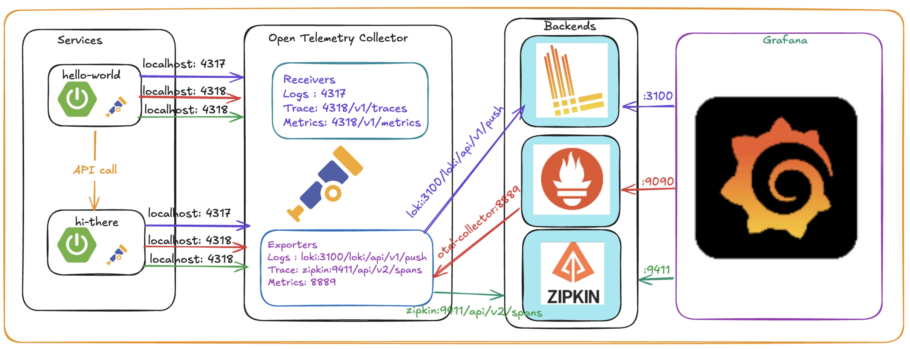

# opentelemetry-demo

## To start the application and other services 
`./start-applications.sh`

## To stop all services and application
`./stop-application.sh `

## To generate some data for metrics; trqces qnd logs
`./api-calls.sh`

## Exq,ple API cqll
`curl http://localhost:8080/hello-zorld`

Alternately you can use postman or any other app to make a rest API call

## Demo Details
In this demo springboot services are used. there is two service hello-world and hi-there. Both are instrumented with logback otel appender and otel SDK and other libraries for generating metrics and traces. All logs , Mertics and Traces are forwareded to the Open telemetry collector in the OTLP format.

### Open telemetry Collector
    Receivers has been configured to accept metrics, logs and traces in OTLP format and exporters are configured to send data to different backend. Logs are sent to Loki, Metrics are pulled by Prometheus and traces are pushed to zipkin backend.

#### Visualisation
Grafana is used for the visualisation. Go to explore and select loki, or prometheus or zipkin for logs, metrics and traces. Data source under config/grafana is configured to pull data from respective backends.

